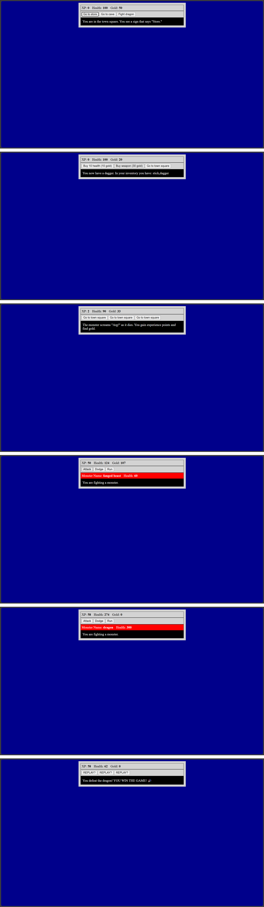

# RPG Dragon Fighting Game

A browser-based RPG fighting game built with **HTML, CSS, and JavaScript** as part of my web development learning journey.

In the game, your goal is to **defeat the dragon**, the main monster of the story. You can fight **fanged beasts and slimes** to earn **gold and XP**, which you can use to purchase better weapons and become strong enough to defeat the dragon.

# 🎮 About the Project
This project is a small RPG-style fighting game where the player can choose attacks, fight enemies, manage health, earn XP and gold, purchase weapons, and progress through battles.

It was built as a hands-on learning project while practicing fundamental JavaScript and web development concepts.

# 🌐 Live Demo
[**Play the RPG Dragon Fighting Game**](https://ahmediabdelhamied.github.io/rpg-dragon-fighting-game/)

# 🖼️ Preview

# 🛠️ Technologies Used
* HTML
* CSS
* JavaScript

# 📚 What I Learned

Through this project, I practiced:
* JavaScript variables and functions
* Arrays and objects
* DOM manipulation
* Event handling
* Conditional logic
* Updating HTML elements dynamically
* Basic game logic
* Connecting JavaScript with HTML and CSS

# 🚀 Future Improvements
As I continue learning JavaScript, I may come back to this project and experiment with:

* New characters
* Additional enemies
* Different attacks
* New game mechanics
* Improved text and game messages

# 📖 Learning Source
This project was created as part of my learning with the **freeCodeCamp JavaScript and full-stack web development for beginners curriculum**.

# 👨‍💻 Author
**Ahmed AbdElhamied**

This repository documents one step in my journey of learning web development and building projects through practice.
